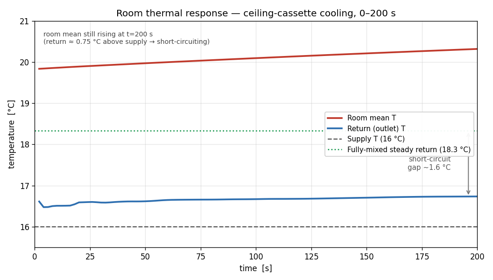

# HVAC CFD — Ceiling-Cassette-Cooled Room

Buoyancy-driven CFD of a single-storey, sloped-roof room cooled by a ceiling-cassette
air-conditioner, built and solved in **OpenFOAM v2012**. The case is parametric,
reproducible, and structured so that ventilation rate, supply temperature, diffuser
design and return location can be swept in follow-on studies.

> Transient **buoyantPimpleFoam** (compressible buoyant: heRhoThermo / perfectGas),
> **k-ω SST** turbulence, cold-started from a uniform 20 °C still-air field and run to
> t = 60 s.

## Results at a glance

| Temperature (t = 60 s) | Velocity (t = 60 s) |
|---|---|
|  |  |

A cold ceiling jet (≈ 0.58 m/s at the jet core) drops to the floor centre, impinges and
spreads, and drives corner recirculation — classic mixing ventilation — while a warmer,
weakly ventilated layer collects under the high side of the mono-pitch roof.

Early transient, for comparison (jet still forming from the uniform start):


Full animations: [`T_animation.mp4`](T_animation.mp4), [`U_animation.mp4`](U_animation.mp4).

## Model summary

| Item | Value |
|---|---|
| Room | 5.5 × 4.5 m plan, mono-pitch roof 3.6 → 2.8 m, ≈ 79 m³ |
| Heat sources | 3 occupants × 75 W + equipment 200 W + window ≈ 181 W ≈ **609 W** sensible |
| Ventilation | 0.26 kg/s supply (≈ 10 ACH), 16 °C |
| Window | convective, h = 5.7 W/m²K, T∞ = 40 °C |
| Mesh | body-fitted hex, sloped-roof block, ≈ 72k cells, checkMesh clean |
| Turbulence | k-ω SST, high-Re wall functions (no resolved layers — see Notes) |

See [`HVAC_CFD_ceiling_cassette_room_report.pdf`](HVAC_CFD_ceiling_cassette_room_report.pdf)
for the full write-up (method, a ventilation-flux defect found and fixed, results, and a
roadmap of follow-on studies).

## Layout

```
0/                initial & boundary conditions (U, T, p, p_rgh, k, omega, nut, alphat)
constant/         thermophysical / turbulence / g; triSurface STLs for the obstacles only
system/           blockMeshDict, snappyHexMeshDict, topoSetDict, createPatchDict, fv*, controlDict
geometry/         build_room.py (+ historical make_case.py) — see geometry/README.md
Allmesh           blockMesh → feature extract → snappyHexMesh → topoSet → createPatch
Allrun            ./Allmesh, then the transient buoyantPimpleFoam solve
Allpost           post-processing function objects
render.py, anim.py   slice + animate the fields (VTK + matplotlib + ffmpeg)
docs/             report (pdf/docx) and the figures used above
```

How the geometry is meshed: the **room shell** (floor, walls, sloped roof) is the
body-fitted `blockMesh` block; only the **occupants and equipment** are STL-meshed by
`snappyHexMesh`; the **supply ring, central outlet and window** are carved from clean
boundary faces with `topoSet` + `createPatch`. (See `geometry/README.md`.)

## Reproduce

Requires OpenFOAM v2012 (ESI / openfoam.com). FreeCAD 0.21 is only needed to regenerate
geometry from `geometry/build_room.py`.

```bash
./Allmesh      # builds the mesh (constant/polyMesh is .gitignored — regenerated here)
./Allrun       # ./Allmesh, then renumberMesh, then the transient buoyantPimpleFoam run
./Allpost      # wall heat flux, supply/return mass flow, mean temperatures
python render.py   # render slice frames; ffmpeg assembles the mp4s
```

## Notes

- The mesh (`constant/polyMesh/`), solver time directories (`1/`…), logs and
  post-processing output are intentionally **not** committed — they are regenerated
  deterministically by `./Allmesh` and `./Allrun`. Only `0/` (the setup) is tracked.
- The run is a **cold-started transient** reaching t = 60 s (≈ 1/6 of an air change),
  so bulk temperatures reflect the early cooling-down phase. Run longer, or add a steady
  `buoyantSimpleFoam` initialisation, before quoting comfort metrics (PMV/PPD, draught
  rate, ADPI).
- `addLayers` is off and high-Reynolds wall functions are used, so near-wall momentum and
  heat transfer are under-resolved — adequate for this baseline, a target for refinement.

## Extended transient (0–200 s)

A longer run (`endTime 200`, writing every 2 s) was carried out to let the flow
develop. The flow **structure** settles early (a narrow cold jet descending from
the cassette to the floor), but the room does **not** reach thermal steady state:
the room-mean temperature keeps climbing (~19.8 → 20.3 °C) while the return runs
only ~0.75 °C above the 16 °C supply — about 1.6 °C below the ~18.3 °C a
fully-mixed room would give. That gap is the signature of **short-circuiting**:
with the supply ring and return concentric in the ceiling, much of the cold jet
returns to the central outlet without mixing into the occupied zone, so the room
sheds its ~609 W load inefficiently. This points at the return location / diffuser
throw as the first design lever, and makes a clean next parametric study.



Animation (temperature + velocity, each with streamlines on the y = 2.25 m plane):
[`HVAC_flow_t200.mp4`](HVAC_flow_t200.mp4). Full history: [`docs/flow_history.csv`](docs/flow_history.csv).

> Note: this extended run used the current ESI OpenFOAM build with the Courant
> limit relaxed to 6 for throughput, so it is visualisation-grade rather than
> bit-identical to a strict Co≤2 v2012 solve; the qualitative flow and the
> short-circuit finding are robust to that.

## How this was built

The geometry, mesh, case setup, solver runs, post-processing and the report were developed
interactively with **Claude (Cowork)** driving FreeCAD / OpenFOAM / ParaView on the
author's workstation. The repository was then cleaned up, reviewed and published to GitHub
with Claude, using **Claude in Chrome** to inspect the live repository in the browser.

---
*Author: Mohamed Asick Moulana Jahir Hussain · OpenFOAM v2012*
