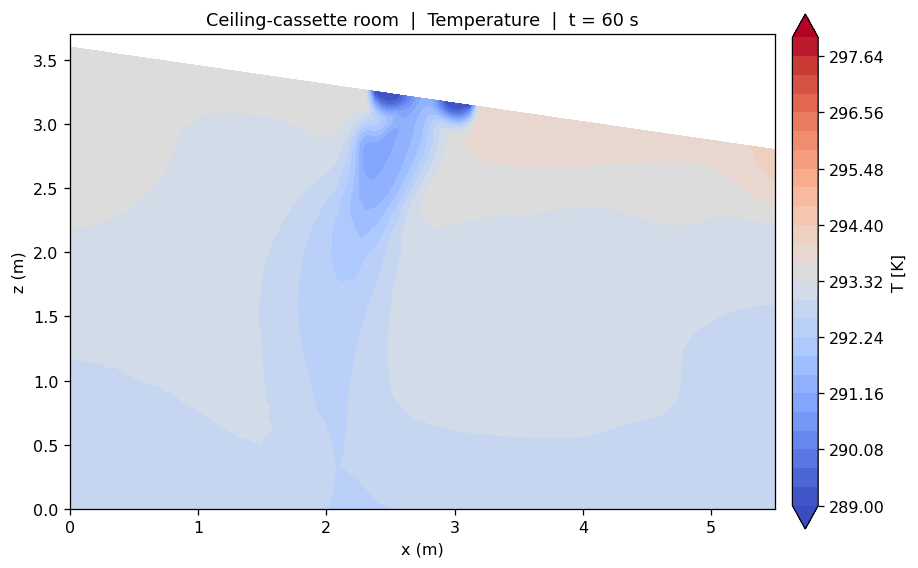
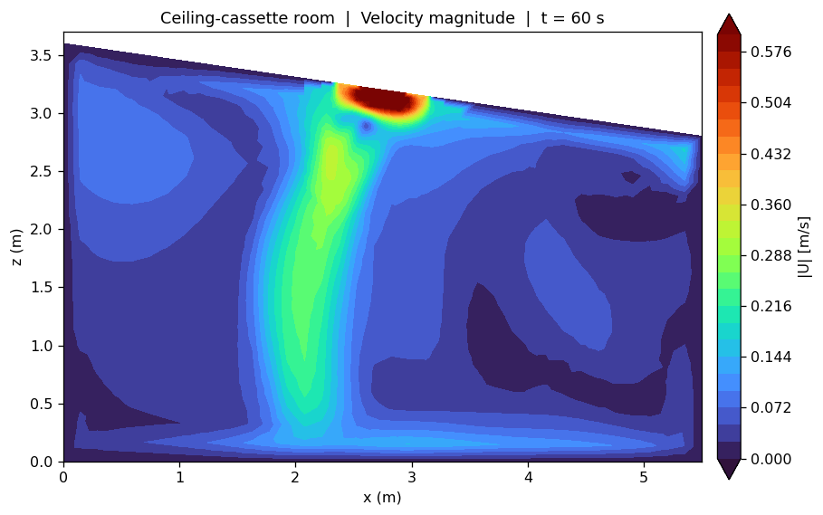
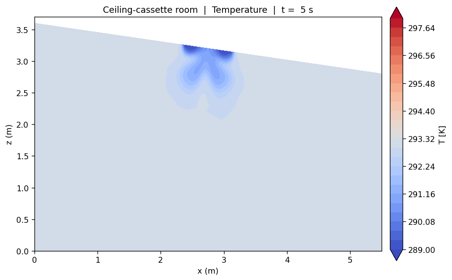

# HVAC CFD — Ceiling-Cassette-Cooled Room

Buoyancy-driven CFD of a single-storey, sloped-roof room cooled by a ceiling-cassette
air-conditioner, built and solved in **OpenFOAM v2012**. The case is parametric,
reproducible, and structured so that ventilation rate, supply temperature, diffuser
design and return location can be swept in follow-on studies.

> Steady **buoyantSimpleFoam** initialisation → transient **buoyantPimpleFoam**, with
> compressible buoyant physics (heRhoThermo / perfectGas) and k-ω SST turbulence.

## Results at a glance

| Temperature (t = 60 s) | Velocity (t = 60 s) |
|---|---|
|  |  |

A cold ceiling jet (≈ 0.58 m/s) drops to the floor centre, impinges and spreads, and
drives corner recirculation — classic mixing ventilation — while a warmer, weakly
ventilated layer collects under the high side of the mono-pitch roof.

Early transient, for comparison (jet still forming):



Full animations: [`T_animation.mp4`](T_animation.mp4), [`U_animation.mp4`](U_animation.mp4).

## Model summary

| Item | Value |
|---|---|
| Room | 5.5 × 4.5 m plan, mono-pitch roof 3.6 → 2.8 m, ≈ 79 m³ |
| Heat sources | 3 occupants × 75 W + equipment 200 W + window ≈ 181 W ≈ **609 W** sensible |
| Ventilation | 0.26 kg/s supply (≈ 10 ACH), 16 °C |
| Window | convective, h = 5.7 W/m²K, T∞ = 40 °C |
| Mesh | body-fitted hex, sloped-roof block, ≈ 72k cells, checkMesh clean |
| Turbulence | k-ω SST, high-Re wall functions |

See [`HVAC_CFD_ceiling_cassette_room_report.pdf`](HVAC_CFD_ceiling_cassette_room_report.pdf)
for the full write-up (method, a ventilation-flux defect found and fixed, results,
and a roadmap of follow-on studies).

## Layout

```
0/                initial & boundary conditions (U, T, p, p_rgh, k, omega, nut, alphat)
constant/         thermophysical / turbulence / g; triSurface STLs for obstacles & patches
system/           blockMeshDict, snappyHexMeshDict, topoSetDict, createPatchDict, fv*, controlDict
geometry/         build_room.py, make_case.py  (parametric FreeCAD geometry + case generation)
Allmesh           blockMesh → feature extract → snappy → topoSet → createPatch
Allrun            steady then transient solve
Allpost           post-processing function objects
render.py, anim.py   slice + animate the fields (VTK + matplotlib + ffmpeg)
docs/             report (pdf/docx) and the figures used above
```

## Reproduce

Requires OpenFOAM v2012 (ESI / openfoam.com). FreeCAD 0.21 is only needed to regenerate
geometry from `geometry/build_room.py`.

```bash
./Allmesh      # builds the mesh (constant/polyMesh is .gitignored — regenerated here)
./Allrun       # steady initialisation, then the transient run
./Allpost      # wall heat flux, supply/return mass flow, mean temperatures
python render.py   # render slice frames; ffmpeg assembles the mp4s
```

## Notes

- The mesh (`constant/polyMesh/`), solver time directories (`1/`…), logs and
  post-processing output are intentionally **not** committed — they are regenerated
  deterministically by `./Allmesh` and `./Allrun`. Only `0/` (the setup) is tracked.
- The transient shown here reaches t = 60 s (≈ 1/6 of an air change), so bulk
  temperatures reflect the early cooling-down phase. Run the steady case to convergence,
  or extend the transient, before quoting comfort metrics (PMV/PPD, draught rate, ADPI).

---
*Author: Mohamed Asick Moulana Jahir Hussain · OpenFOAM v2012*
